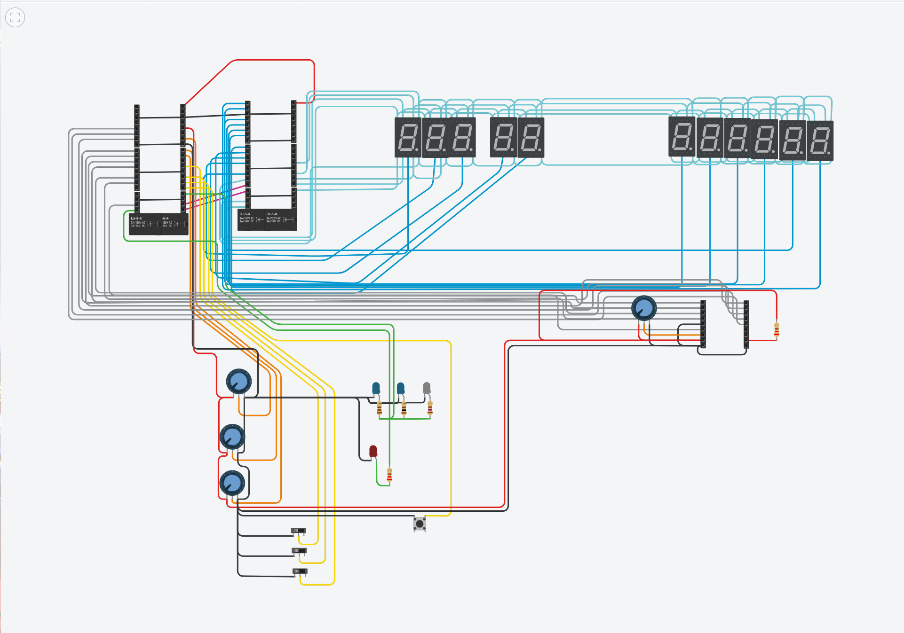

## Model of a TRIGA Mark II research reactor

This was created for a school project;

it features a 1:8 scale 3D printed model of the research reactor with a control panel (both designed / modeled by my friend, with whom we created this whole project), powered by a computer simulation running on 1 core of a Raspberry Pi Pico 2 microcontroller.

### 3D printed model

I won't speak much about the model, since it wasn't my work, but overall it was composed of about 38 different pieces of three different colors.

I think we used about 8 kg of plastic (of only the main color)!

We printed 10 - 14 hours every day for about two weeks to get this done.

(In the end we also enlisted some help from the school's 3D printers, as we wouldn't have everything printed on time otherwise.)

### Electronics

Even though the model runs on a single core, three cores are used along two RPI Picos (connected via UART).

This is because:

A - one Pico didn't have enough GPIO and the most cost effective solution was to add another

B - driving the LCD and other I/O is not fast enough to run inbetween simulation loops

Apart from the two [picos](https://www.reichelt.com/si/en/shop/product/raspberry_pi_pico_2_rp235x_cortex-m33_microusb-383358), other electronics include

- [11 7-segment displays (6 for power, 2 for water temperature, 3 for fuel temperature)](https://www.reichelt.com/de/en/shop/product/7-segment_display_red_14_2_mm_according_to_cathode-54120#closemodal),
- [a 4x20 LCD character display, used to display the neutron count, reactivity and rod positions](https://www.reichelt.com/de/en/shop/product/4x20_dip_character_display_black_white-348142),
- [three 100 mm travel sliding potentiometers, which are used to control the control rod positions](https://www.reichelt.com/de/en/shop/product/alps_high-quality_sliding_potentiometer_linear_stereo_10k-73873),
- [a big SCRAM button](https://www.reichelt.com/si/en/shop/product/arcade_button_red-317435),
- [three toggle switches (automatic / manual control, active cooling system on / off and SCRAMs on / off)](https://www.reichelt.com/de/en/shop/product/miniature_toggle_switch_on-off_3_a_125_v-359360),
- leds, to show [SCRAM status](https://www.reichelt.com/de/en/shop/product/led_10mm_wired_red_10000_mcd_60_-361993) and Cherenkov radiation in the core - [1](https://www.reichelt.com/de/en/shop/product/led_3_mm_wired_cold_white_8000_mcd_25_-347927) [2](https://www.reichelt.com/de/en/shop/product/led_3_mm_wired_blue_2400_mcd_30_-230893) [3](https://www.reichelt.com/de/en/shop/product/led_3_mm_wired_blue_2500_mcd_30_-342035)

### Simulation

The simulation is based off a [paper from the Jožef Stefan Institude in Ljubljana](https://www.sciencedirect.com/science/article/pii/S0306454920303285#t0005) about a PC simulator.

This pico based model uses their math and very small part of [their code](https://github.com/ijs-f8/Research-Reactor-Simulator), which was optimized to run in real time.

It is not created to model Xenon poisoning or pulse operations of the reactor.

Control rod worths are assumed to be linear.

### Sources

- [Description of TRIGA Reactor (M. Ravnik)](https://ric.ijs.si/wp-content/uploads/Description_TRIGA_Reactor.pdf) - figures and schematics of the reactor, dimensions
- [PC-based JSI research reactor simulator (Jan Malec, Dan Toškan, Luka Snoj)](https://www.sciencedirect.com/science/article/pii/S0306454920303285#t0005) - physical base of the simulation, adapted for RPi Pico 2
- [ijs-f8/Research-Reactor-Simualtor](https://github.com/ijs-f8/Research-Reactor-Simulator) - certain constants needed for a full simulation not present in the paper, one specific mathematical method in code; always credited when applicable
